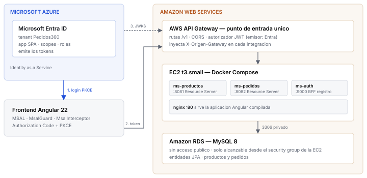

# Informe del encargo

`Pedidos360-informe-encargo.pdf` documenta la solucion entregada: arquitectura,
componentes, decisiones de diseño con su justificacion, limitaciones asumidas y
evidencias de funcionamiento.

## Regenerarlo

El PDF se compone de tres fuentes y se arma con Chromium, sin dependencias
adicionales:

```bash
cd docs/informe
python3 - <<'PY'
import base64, pathlib
ev = pathlib.Path('../evidencias')
html = pathlib.Path('informe.html').read_text()
html = html.replace('',
                    f'<div class="diagrama">{pathlib.Path("diagrama.svg").read_text()}</div>')
for m, a in [('EV_02','02-login-microsoft.png'), ('EV_05','05-catalogo.png'),
             ('EV_07','07-claims-del-token.png')]:
    html = html.replace(f'src="{m}"',
        'src="data:image/png;base64,' + base64.b64encode((ev/a).read_bytes()).decode() + '"')
html = html.replace('<link rel="stylesheet" href="estilo.css">',
    '<style>' + pathlib.Path('estilo.css').read_text() +
    '\n.diagrama svg{width:100%;height:auto;display:block}</style>')
pathlib.Path('informe-armado.html').write_text(html)
PY

chromium --headless --disable-gpu --no-sandbox \
  --print-to-pdf="$PWD/Pedidos360-informe-encargo.pdf" \
  --no-pdf-header-footer "file://$PWD/informe-armado.html"
rm informe-armado.html
```

| Archivo | Contenido |
|---|---|
| `informe.html` | El texto, con marcas `EV_xx` donde van las capturas |
| `estilo.css` | Maquetacion para impresion en A4 |
| `diagrama.svg` | Diagrama de arquitectura |

Las capturas salen de `docs/evidencias/`, que a su vez genera
`scripts/verificar-pkce.mjs`. Actualizar las evidencias y volver a armar el PDF
mantiene el informe al dia sin editarlo a mano.
